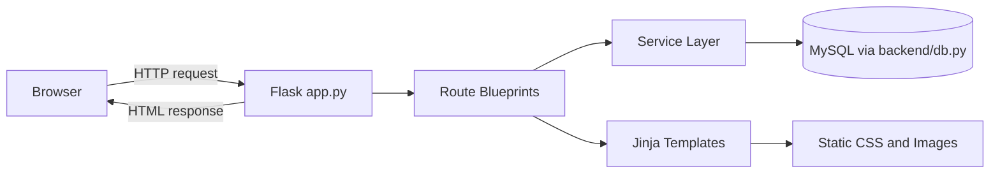
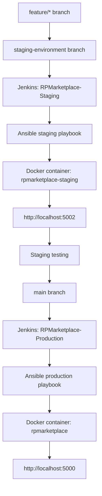
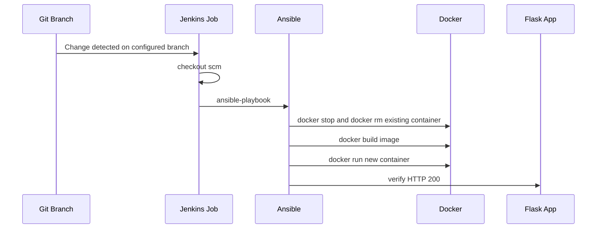

# RP Marketplace - Republic Polytechnic Student Marketplace


## Project Overview

RP Marketplace is a Flask web application for Republic Polytechnic students to browse, list, request, and manage second-hand marketplace items. The application uses server-rendered Jinja templates, Flask blueprints, and MySQL as the only runtime data store.

This repository also contains the completed DevOps implementation for the C270 project: Git branch workflow, Docker containerization, Jenkins automation, Ansible deployment, staging deployment, production deployment, and automated tests.

## Main Application Features

| User Area | Implemented Features |
| --- | --- |
| Student account | Register, log in, log out, support legacy login by email or student ID, and record password reset requests for admin review. |
| Marketplace | Browse products, search by title, filter by category, view product details, and see request state such as sold, pending, or requestable. |
| Wishlist | Add marketplace items to a wishlist, view saved items, and remove saved items. |
| Product requests | Request to buy available products, prevent duplicate active requests, block requests for sold items, and notify users when requests are submitted, approved, or rejected. |
| Seller dashboard | View own listings, filter listings by status, add products, edit products, delete products, and review buyer requests for owned products. |
| Chat | Buyers can chat with sellers for a product, and sellers can view product conversations. |
| Administrator | View dashboard activity, manage users, search and filter users, edit users, delete users, block or unblock users, and review successful and failed login logs. |

## DevOps Objectives

The DevOps implementation in this repository is complete and working for the local project environment. It is designed to:

- Keep development work on feature branches before testing in staging.
- Deploy the `staging-environment` branch through the Jenkins staging job.
- Deploy the `main` branch through the Jenkins production job.
- Use Jenkins to detect branch changes and run the configured pipeline.
- Use Ansible from Jenkins to manage Docker deployments.
- Run staging and production as separate Docker containers on separate host ports.
- Keep Jenkins state through the existing persistent `jenkins-data`.

## Technology Stack

| Technology | Purpose In This Project |
| --- | --- |
| Python 3.11 | Runtime used by the Flask application, Docker images, and GitHub Actions workflow. |
| Flask | Backend web framework for routes, sessions, templates, and HTTP responses. |
| Jinja | Server-rendered HTML templates stored under `frontend/templates`. |
| HTML and CSS | User, seller, and admin interface pages and styling. |
| MySQL | Single source of truth for runtime application data. |
| Pytest | Automated test suite in `tests/test_app.py`. |
| Docker | Packages and runs the Flask application in containers. |
| Jenkins | Runs the configured staging and production pipelines. |
| Ansible | Stops, removes, rebuilds, starts, and verifies Docker containers. |
| GitHub Actions | Runs dependency installation, pytest, and Docker image build on push and pull request. |
| Git and GitHub | Source control and branch-based collaboration. |

## System Architecture

The main application entry point is `app.py`. It imports `create_app()` from `backend/app.py`, which creates the Flask application, configures template and static directories, ensures the default admin account exists in MySQL, and registers blueprints from `backend/routes`.



## Repository Structure

| Path | Purpose |
| --- | --- |
| `app.py` | Root Flask launcher used locally and by Docker through `FLASK_APP=app:app`. |
| `backend/app.py` | Flask application factory and blueprint registration. |
| `backend/routes/` | Route blueprints for auth, admin, marketplace, seller dashboard, and chat pages. |
| `backend/services/` | Business logic for accounts, products, requests, notifications, sellers, admin, and chat. |
| `backend/utils/` | Shared backend utilities such as date filters. |
| `database/legacy_seed_data/` | Archived JSON seed data used only by migration scripts and migration tests. |
| `database/schema.sql` | Authoritative MySQL schema. |
| `frontend/templates/` | Jinja templates rendered by Flask. |
| `frontend/static/` | CSS and image assets, including `rp-logo.png`. |
| `tests/test_app.py` | Pytest coverage for app startup, routes, auth, marketplace, wishlist, seller, and product request behavior. |
| `Dockerfile` | Root production-style Flask image used by the Ansible deployment playbooks. |
| `.dockerignore` | Excludes Git metadata, caches, virtual environments, logs, and build outputs from Docker build context. |
| `docker/` | Optional compose/nginx Docker assets separate from the Jenkins Ansible deployment path. |
| `Jenkinsfile` | Production Jenkins pipeline script for `RPMarketplace-Production`. |
| `Jenkinsfile.staging` | Staging Jenkins pipeline script for `RPMarketplace-Staging`. |
| `ansible/hosts` | Local Ansible inventory using `localhost ansible_connection=local`. |
| `ansible/deploy_docker_playbook.yaml` | Production Docker deployment playbook. |
| `ansible/deploy_staging_playbook.yaml` | Staging Docker deployment playbook. |
| `.github/workflows/ci.yml` | GitHub Actions CI workflow. |
| `devops/` and `docs/` | Supporting project documentation. |

## Git Branching Strategy

| Branch Type | Purpose |
| --- | --- |
| `feature/*` | Development branches such as `feature/login`, `feature/dashboard`, `feature/docker-setup`, and other feature work. |
| `staging-environment` | Integration and staging branch. Feature branches should be merged here for testing before production. |
| `main` | Production branch used by the production Jenkins job. |

Feature branches should be merged into `staging-environment` first. After staging deployment and testing are successful, the tested changes can be merged into `main` for production deployment.

## Development And Deployment Workflow



## Docker Implementation

The active Jenkins/Ansible deployment uses the root `Dockerfile`.

| Docker Setting | Value |
| --- | --- |
| Base image | `python:3.11-slim` |
| Working directory | `/app` |
| Flask app | `app:app` |
| Container listen port | `5000` |
| Start command | `flask run` |
| Copied application files | `app.py`, `backend/`, `frontend/`, `requirements.txt` |
| Dependencies | Installed from `requirements.txt` |

Build the root application image:

```bash
docker build -t rp-marketplace .
```

Run the application locally on production port `5000`:

```bash
docker run -d --name rpmarketplace -p 5000:5000 rp-marketplace
```

Run a staging-style container on host port `5002`:

```bash
docker build -t rp-marketplace-staging .
docker run -d --name rpmarketplace-staging -p 5002:5000 rp-marketplace-staging
```

Verify running containers:

```bash
docker ps
```

Warning: the following commands stop and remove local containers. Use them only when replacing or cleaning up the local deployment.

```bash
docker stop rpmarketplace
docker rm rpmarketplace
docker stop rpmarketplace-staging
docker rm rpmarketplace-staging
```

The repository also includes optional Docker Compose assets under `docker/`:

| File | Purpose |
| --- | --- |
| `docker/docker-compose.yml` | Defines a backend Flask service and a frontend nginx reverse proxy. The frontend maps host port `5000` to nginx port `80`. |
| `docker/docker-compose.staging.yml` | Compose override that renames staging containers and maps backend `5001:5000` and frontend `8081:80`. |
| `docker/Dockerfile.backend` | Flask backend image matching the root Dockerfile behavior. |
| `docker/Dockerfile.frontend` | nginx image that copies `docker/nginx.conf`. |
| `docker/nginx.conf` | Proxies nginx traffic to `backend:5000`. |

Run the optional compose setup from the repository root:

```bash
docker compose -f docker/docker-compose.yml up --build
```

Run the optional compose staging override:

```bash
docker compose -f docker/docker-compose.yml -f docker/docker-compose.staging.yml up --build
```

Warning: `docker compose down -v` deletes compose-managed volumes. This repository's compose command does not require `-v` for normal shutdown.

```bash
docker compose -f docker/docker-compose.yml down
```

## Jenkins Implementation

Jenkins has two configured jobs: one for staging and one for production. Both pipeline files use `agent any`, check out the configured branch with `checkout scm`, and then execute Ansible inside the existing `jenkins_server` container.

| Environment | Jenkins Job | Branch | Pipeline Script | Ansible Playbook | URL |
| --- | --- | --- | --- | --- | --- |
| Staging | `RPMarketplace-Staging` | `staging-environment` | `Jenkinsfile.staging` | `ansible/deploy_staging_playbook.yaml` | `http://localhost:5002` |
| Production | `RPMarketplace-Production` | `main` | `Jenkinsfile` | `ansible/deploy_docker_playbook.yaml` | `http://localhost:5000` |

Production pipeline stages in `Jenkinsfile`:

| Stage | What It Does |
| --- | --- |
| `Checkout Source Code` | Runs `checkout scm` for the production job's configured SCM branch. |
| `Deploy to Production` | Runs `ansible-playbook -i ansible/hosts ansible/deploy_docker_playbook.yaml` inside `jenkins_server` from `/var/jenkins_home/workspace/RPMarketplace-Production`. |
| `Confirm Production URL` | Prints `Production is available at: http://localhost:5000`. |

Staging pipeline stages in `Jenkinsfile.staging`:

| Stage | What It Does |
| --- | --- |
| `Checkout Source Code` | Runs `checkout scm` for the staging job's configured SCM branch. |
| `Deploy to Staging with Ansible` | Runs `ansible-playbook -i ansible/hosts ansible/deploy_staging_playbook.yaml` inside `jenkins_server` from `/var/jenkins_home/workspace/RPMarketplace-Staging`. |

Jenkins was recovered using the existing persistent `jenkins-data`. Do not recreate, delete, or overwrite Jenkins data during normal setup or documentation steps.

## Ansible Implementation

The inventory in `ansible/hosts` deploys to the local machine:

```ini
[local]
localhost ansible_connection=local
```

Jenkins invokes Ansible, and Ansible manages Docker deployment. The playbooks verify Docker, stop and remove the previous container if it exists, build a Docker image from the repository root, run a new container, and verify the app URL.

| Environment | Playbook | Image | Container | Port Mapping | Verification URL |
| --- | --- | --- | --- | --- | --- |
| Staging | `ansible/deploy_staging_playbook.yaml` | `rp-marketplace-staging` | `rpmarketplace-staging` | `5002:5000` | `http://host.docker.internal:5002/` |
| Production | `ansible/deploy_docker_playbook.yaml` | `rp-marketplace` | `rpmarketplace` | `5000:5000` | `http://host.docker.internal:5000/` |

Run the production playbook manually from the repository root:

```bash
ansible-playbook -i ansible/hosts ansible/deploy_docker_playbook.yaml
```

Run the staging playbook manually from the repository root:

```bash
ansible-playbook -i ansible/hosts ansible/deploy_staging_playbook.yaml
```

Test local Ansible connectivity:

```bash
ansible all -i ansible/hosts -m ping
```

Warning: both deployment playbooks intentionally stop and remove their target containers before starting replacements.

## Staging Environment

The staging environment is deployed from the `staging-environment` branch by the `RPMarketplace-Staging` Jenkins job. The staging pipeline uses `Jenkinsfile.staging`, which invokes `ansible/deploy_staging_playbook.yaml`.

| Setting | Staging Value |
| --- | --- |
| Branch | `staging-environment` |
| Jenkins job | `RPMarketplace-Staging` |
| Pipeline file | `Jenkinsfile.staging` |
| Ansible playbook | `ansible/deploy_staging_playbook.yaml` |
| Docker image | `rp-marketplace-staging` |
| Docker container | `rpmarketplace-staging` |
| Host port | `5002` |
| Container port | `5000` |
| Access URL | `http://localhost:5002` |

## Production Environment

The production environment is deployed from the `main` branch by the `RPMarketplace-Production` Jenkins job. The production pipeline uses `Jenkinsfile`, which invokes `ansible/deploy_docker_playbook.yaml`.

| Setting | Production Value |
| --- | --- |
| Branch | `main` |
| Jenkins job | `RPMarketplace-Production` |
| Pipeline file | `Jenkinsfile` |
| Ansible playbook | `ansible/deploy_docker_playbook.yaml` |
| Docker image | `rp-marketplace` |
| Docker container | `rpmarketplace` |
| Host port | `5000` |
| Container port | `5000` |
| Access URL | `http://localhost:5000` |

## CI/CD Pipeline Stages



| Pipeline | Stages |
| --- | --- |
| GitHub Actions CI | Checkout repository, set up Python 3.11, install dependencies, clear pytest cache, run `python -m pytest`, and build Docker image `c270-e62h-team3`. |
| Jenkins staging | Checkout source code, deploy to staging with Ansible, report success or failure. |
| Jenkins production | Checkout source code, deploy to production with Ansible, print production URL, report success or failure. |

## Local Setup And Usage

Create and activate a Python virtual environment:

```bash
python -m venv .venv
```

Windows PowerShell:

```powershell
.\.venv\Scripts\Activate.ps1
```

Linux or macOS:

```bash
source .venv/bin/activate
```

Install dependencies:

```bash
pip install -r requirements.txt
```

Create local environment configuration:

```bash
copy .env.example .env
```

Fill in your local MySQL credentials in `.env`. Do not commit `.env`.

Start your local MySQL Server, then initialize and verify the database:

```bash
python database/init_database.py
python database/init_database.py --verify
```

Run the Flask application locally:

```bash
python app.py
```

Open the local application:

```text
http://127.0.0.1:5000
```

Run tests:

```bash
python -m pytest
```

## Runtime Data Store

MySQL is now the only runtime data store. Normal application execution follows:

```text
Flask routes -> service layer -> backend/db.py -> MySQL
```

Archived JSON files live under `database/legacy_seed_data/` only as migration seed data, backup, and reference material. Do not edit those JSON files for new application data.

New features requiring database changes must update `database/schema.sql`, the relevant module SQL file when appropriate, migration/setup logic, service-layer MySQL queries, and tests.

Docker, Jenkins, Ansible, staging, and production database integration remains deferred until local MySQL-only runtime is fully approved.

## Staging And Production Access URLs

| Environment | URL |
| --- | --- |
| Staging | `http://localhost:5002` |
| Production | `http://localhost:5000` |

## Testing And Deployment Verification

Automated tests are located in `tests/test_app.py` and can be run with:

```bash
python -m pytest
```

The tests cover:

- Application startup.
- Public routes.
- Student and admin login behavior.
- User registration validation.
- Marketplace search and category filtering.
- Wishlist add and remove behavior.
- Seller dashboard listing add, edit, delete, and filtering.
- Product request creation, approval, rejection, access control, duplicate prevention, and sold-item handling.
- Failed login logging and password reset request logging.

Deployment verification is performed by the Ansible playbooks:

| Environment | Verification |
| --- | --- |
| Staging | `ansible/deploy_staging_playbook.yaml` retries `http://host.docker.internal:5002/` until HTTP `200`. |
| Production | `ansible/deploy_docker_playbook.yaml` retries `http://host.docker.internal:5000/` until HTTP `200`. |

Manual browser checks:

```text
http://localhost:5002
http://localhost:5000
```

## Troubleshooting

| Issue | Check |
| --- | --- |
| Jenkins job deploys the wrong code | Confirm the job branch: staging uses `staging-environment`, production uses `main`. |
| Staging URL is unavailable | Check that container `rpmarketplace-staging` is running and that port `5002` is mapped to container port `5000`. |
| Production URL is unavailable | Check that container `rpmarketplace` is running and that port `5000` is mapped to container port `5000`. |
| Ansible cannot reach Docker | Run `docker --version` and confirm Docker Desktop or Docker Engine is running. |
| Ansible cannot reach the app URL | Confirm the container started and inspect container logs with `docker logs <container-name>`. |
| Tests fail locally | Reinstall dependencies with `pip install -r requirements.txt` and rerun `python -m pytest`. |

Safe inspection commands:

```bash
docker ps
docker images
docker logs rpmarketplace
docker logs rpmarketplace-staging
```

Warning: do not delete Jenkins volumes or the existing `jenkins-data` unless performing clearly approved destructive recovery work. Normal project operation should preserve the existing Jenkins data.

Warning: commands such as `docker rm`, `docker volume rm`, `docker compose down -v`, and filesystem deletion commands can remove containers, volumes, Jenkins data, or local files. Use them only when the impact is understood.

## Screenshots Or Evidence

Evidence files and assets present in this repository include:

| File Or Folder | Evidence |
| --- | --- |
| `Jenkinsfile` | Production Jenkins pipeline for `RPMarketplace-Production`. |
| `Jenkinsfile.staging` | Staging Jenkins pipeline for `RPMarketplace-Staging`. |
| `ansible/deploy_docker_playbook.yaml` | Production Docker deployment automation. |
| `ansible/deploy_staging_playbook.yaml` | Staging Docker deployment automation. |
| `Dockerfile` | Root Flask container image definition. |
| `.github/workflows/ci.yml` | GitHub Actions validation workflow. |
| `jenkins-auto-test.txt` | Repository evidence file related to Jenkins testing. |
| `frontend/static/images/rp-logo.png` | Application image asset used by the frontend. |

Add project screenshots to this section if they are committed to the repository later. No uncommitted screenshot file is documented here.

## Contributors

Repository Git history includes commits from the following author identifiers. Email addresses are intentionally omitted from this README.

| Contributor Identifier |
| --- |
| `jackso271` |
| `ceceliatan` |
| `Jet` |
| `25046724` |
| `Win-HP` |
| `0llieu` |
| `Jason` |
