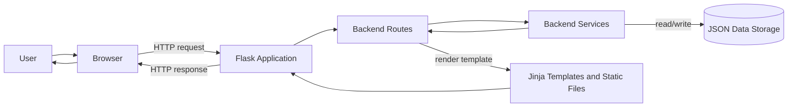
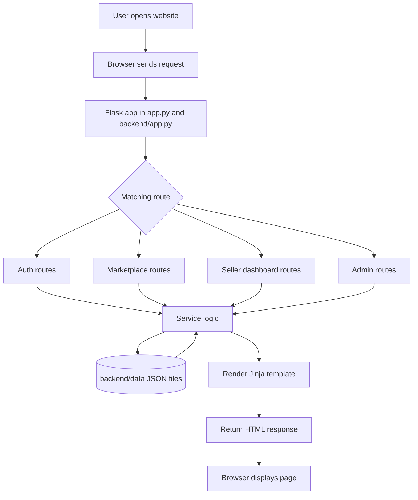
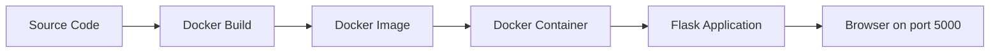
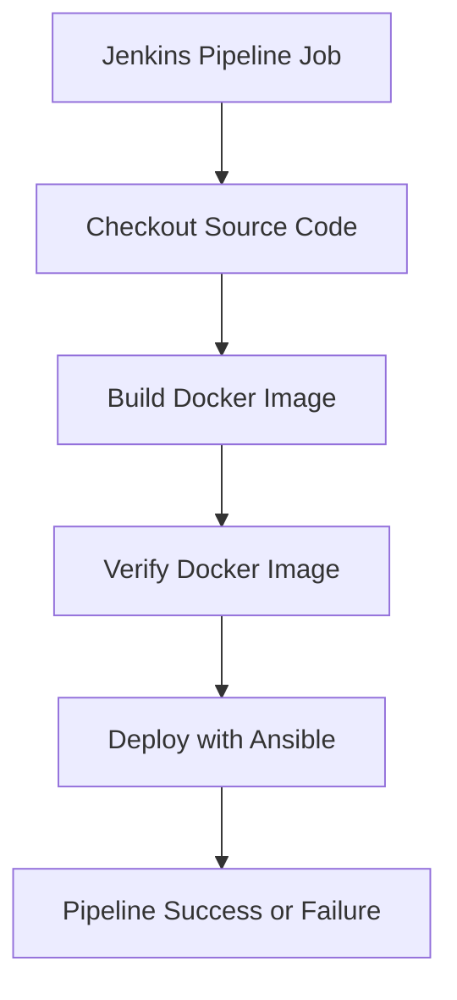
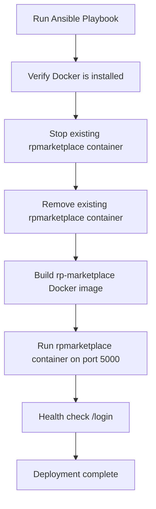
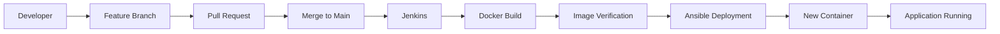

# RP Marketplace - Republic Polytechnic Student Marketplace


## Project Overview

RP Marketplace is a Flask web application for Republic Polytechnic students to browse, list, request, and manage second-hand marketplace items. The application is designed for a campus environment where students can reuse items such as books, electronics, food, and other goods instead of relying on informal chats or external listing platforms.

The purpose of the application is to provide a simple student marketplace with login, registration, marketplace browsing, seller listing management, wishlist management, product requests, notifications, and administrator account review features.

The intended users are:

| User Type | Purpose |
| --- | --- |
| Student | Register, log in, browse marketplace items, search and filter products, add products to a wishlist, and request to buy available items. |
| Seller | Use the seller dashboard to add, edit, delete, and review their own product listings and respond to product requests. |
| Administrator | Manage user accounts, view successful and failed login logs, block or unblock accounts, delete users, and review recent activity. |

The overall project objective is to demonstrate a working Flask application supported by DevOps practices in the same repository: source control, Docker containerization, Jenkins automation, Ansible deployment, and automated Python tests.

## Project Architecture

The main application entry point is `app.py`, which imports `create_app()` from `backend/app.py`. The Flask app registers route blueprints from `backend/routes`, calls service functions from `backend/services`, and reads or writes JSON files in `backend/data` through `backend/utils/json_storage.py`.



Request flow:

1. A user opens the website in a browser.
2. The browser sends an HTTP request to the Flask application.
3. Flask matches the request URL to a registered blueprint route.
4. The route reads request data, session data, or query parameters.
5. Route handlers call service functions for business logic.
6. Service functions read from or write to JSON files in `backend/data`.
7. Flask renders a Jinja template from `frontend/templates`.
8. The rendered HTML response is returned to the browser.

The active application uses JSON files for storage.

## Project Structure

| Path | Purpose |
| --- | --- |
| `app.py` | Root compatibility launcher. Imports `create_app()` from `backend.app` and runs the Flask app locally with `python app.py`. |
| `backend/app.py` | Flask application factory. Configures templates, static files, JSON data path, default secret key, data file initialization, admin account creation, and blueprint registration. |
| `backend/routes/` | Flask blueprints for authentication, marketplace pages, administrator pages, and seller dashboard pages. |
| `backend/services/` | Business logic for login, registration, admin actions, marketplace requests, notifications, wishlists, and seller listing management. |
| `backend/utils/` | Shared helpers for JSON file access and date filtering. |
| `backend/data/` | JSON storage used by the application, including users, products, requests, wishlists, notifications, and login logs. |
| `frontend/templates/` | Jinja HTML templates rendered by Flask for user, seller, and admin pages. |
| `frontend/static/` | CSS and image assets used by the templates. |
| `tests/` | Pytest test suite for application startup, routes, authentication, marketplace behavior, wishlists, seller dashboard actions, and product requests. |
| `Dockerfile` | Builds the production-style Flask container image from Python 3.11 slim. |
| `docker-compose.yml` | Runs the web service locally with port mapping and a bind mount for JSON data persistence. |
| `Jenkinsfile` | Defines the Jenkins pipeline stages used by this repository. |
| `Dockerfile.jenkins` | Builds a Jenkins image with Ansible, Python, pip, and Docker CLI installed. |
| `ansible/` | Local Ansible inventory, configuration, connection test playbook, and Docker deployment playbook. |
| `.github/workflows/ci.yml` | GitHub Actions workflow that installs dependencies, runs pytest, and builds a Docker image. |
| `devops/` | Supporting notes for Docker, Jenkins, and Ansible. |
| `docs/` | Additional project documentation. |
| `routes/products.py` | Separate prototype API route module for product CRUD. It is not registered by the main `backend/app.py` application. |
| `backend/server.py` | Separate prototype Flask server that imports `routes/products.py`. It is not used by the root `app.py`, Dockerfile, Jenkinsfile, or Ansible deployment. |
| `backend/database.js` | Separate JavaScript data setup file. It is present in the repository but is not used by the main Flask application. |

## How the Application Works

The application is built around Flask blueprints and service modules.



Complete request flow:

1. The user opens the website at `http://127.0.0.1:5000`.
2. Flask receives the request through the root `app.py` launcher or through `flask run` in the Docker container.
3. `backend/app.py` creates the Flask application and registers blueprints for authentication, admin pages, marketplace pages, and seller dashboard pages.
4. The matching route in `backend/routes` handles the request.
5. The route validates session state, form data, path parameters, or query parameters.
6. The route calls the related service function from `backend/services`.
7. The service performs business logic such as checking login credentials, creating accounts, filtering products, adding wishlist entries, creating product requests, approving or rejecting requests, editing listings, or updating user accounts.
8. JSON data is loaded and saved through `backend/utils/json_storage.py`.
9. Flask renders the required Jinja template from `frontend/templates`.
10. Flask returns the final HTML response to the browser.

### Student Role

Students can register with an RP email address ending in `@myrp.edu.sg`, log in, view the homepage, browse marketplace products, search by product title, filter by category, view product details, add or remove wishlist items, request to buy available products, view notifications, and log out.

### Seller Role

The seller functionality is available to logged-in users through `/seller/dashboard`. A seller can view only their own listings, filter listings by status, add a listing, edit a listing, delete a listing, and review product requests for products they own. Accepting a request marks the product as sold. Rejecting a request records a rejection reason and allows the buyer to request again.

### Administrator Role

Administrators are users with the `admin` role. The default admin account is created by `create_admin()` if it does not already exist. Administrators can access the dashboard, view users, search and filter accounts, edit users, delete users, block or unblock users, view successful login logs, view failed login logs, filter logs by date, delete selected logs, and review recent activity built from available JSON data.

Default admin login:

```text
Login ID: admin
Password: admin123
```

## Local Setup

1. Create and activate a Python virtual environment.
2. Install dependencies:

```bash
pip install -r requirements.txt
```

3. Start the application:

```bash
python app.py
```

4. Open the app:

```text
http://127.0.0.1:5000
```

Default admin login:

```text
Login ID: admin
Password: admin123
```

## How Docker Works

Docker is used to package the Flask application with its Python runtime and dependencies so it can run consistently outside a local Python virtual environment. In this repository, Docker builds an image from the root `Dockerfile` and runs the Flask app on port `5000`.



### Dockerfile

The `Dockerfile` performs these steps:

| Step | What It Does |
| --- | --- |
| `FROM python:3.11-slim` | Uses Python 3.11 slim as the base image. |
| `ENV ...` | Sets Python and Flask environment variables, including `FLASK_APP=app:app`, host `0.0.0.0`, and port `5000`. |
| `WORKDIR /app` | Sets `/app` as the working directory inside the image. |
| `COPY requirements.txt ./` | Copies dependency definitions first. |
| `RUN pip install --no-cache-dir -r requirements.txt` | Installs Flask and pytest from `requirements.txt`. |
| `COPY app.py ./` | Copies the root Flask launcher. |
| `COPY backend ./backend` | Copies backend routes, services, utilities, and JSON data. |
| `COPY frontend ./frontend` | Copies templates, static CSS, and images. |
| `EXPOSE 5000` | Documents that the container listens on port `5000`. |
| `CMD ["flask", "run"]` | Starts the Flask application in the container. |

### Docker Compose

The `docker-compose.yml` file defines one service named `web`.

| Compose Setting | Value |
| --- | --- |
| Service | `web` |
| Build context | `.` |
| Port mapping | `5000:5000` |
| Environment | `FLASK_ENV=production` |
| Volume | `./backend/data:/app/backend/data` |

The volume keeps the repository's JSON data folder connected to the container's `/app/backend/data` folder, so data written by the application remains available on the host while the container runs.

### Docker Commands

Docker prerequisites:

- Docker Desktop or Docker Engine installed
- Docker service started
- Project cloned locally
- Terminal opened at the project root folder

Check that Docker is installed:

```bash
docker --version
```

Check that Docker can run commands:

```bash
docker ps
```

Build the Docker image:

```bash
docker build -t rp-marketplace .
```

Run the Flask application container on port `5000`:

```bash
docker run -d -p 5000:5000 --name rpmarketplace rp-marketplace
```

Verify that the container is running:

```bash
docker ps
```

Open the application in a browser:

```text
http://127.0.0.1:5000
```

Stop the running container:

```bash
docker stop rpmarketplace
```

Remove the stopped container:

```bash
docker rm rpmarketplace
```

Start the application with Docker Compose:

```bash
docker compose up --build
```

Stop and remove Docker Compose containers:

```bash
docker compose down
```

## How Jenkins Works

Jenkins automation is defined in the root `Jenkinsfile`. The pipeline uses `agent any`, checks out the configured source code, builds a Docker image, verifies that the image exists locally, and then calls the Ansible deployment playbook.



### Jenkins Source Code Checkout

Jenkins obtains the source code through the configured Pipeline SCM job. Inside the `Checkout Source Code` stage, it executes:

```groovy
checkout scm
```

This checks out the repository revision selected by the Jenkins job configuration.

### Jenkins Pipeline Stages

| Stage | Purpose | Jenkins Executes | Expected Output |
| --- | --- | --- | --- |
| `Checkout Source Code` | Retrieves the repository contents for the build workspace. | `checkout scm` | Source files, Dockerfile, Jenkinsfile, Ansible files, and application code are available in the Jenkins workspace. |
| `Build Docker Image` | Builds the Flask application image from the repository Dockerfile. | `docker build -t c270-e62h-team3 .` | A local Docker image named `c270-e62h-team3` is created. |
| `Verify Docker Image` | Confirms that the image was created and is visible to Docker. | `docker images \| grep c270-e62h-team3` | The command prints the matching Docker image row. If no match is found, the stage fails. |
| `Deploy with Ansible` | Runs the Ansible playbook that rebuilds and replaces the running application container. | `ansible-playbook -i ansible/hosts ansible/deploy_docker_playbook.yaml` | Ansible performs the deployment tasks and verifies that `/login` returns HTTP 200. |

The Jenkinsfile does not define a pytest stage. Tests are available in the repository and are run by the GitHub Actions workflow, but Jenkins currently focuses on Docker build verification and Ansible deployment.

Jenkins post actions:

| Build Result | Message |
| --- | --- |
| Success | `Jenkins pipeline completed successfully.` |
| Failure | `Jenkins pipeline failed.` |

## How Ansible Works

Ansible deployment is defined in `ansible/deploy_docker_playbook.yaml`. The inventory in `ansible/hosts` targets `localhost` with `ansible_connection=local`, so the playbook deploys to the local Docker environment.



The deployment playbook performs these tasks in order:

| Order | Task | What It Does |
| --- | --- | --- |
| 1 | Verify Docker is installed | Runs `docker --version` and does not mark the task as changed. |
| 2 | Stop existing `rpmarketplace` container if it exists | Runs `docker stop rpmarketplace`. Failure is allowed so the playbook can continue when the container does not exist. |
| 3 | Remove existing `rpmarketplace` container if it exists | Runs `docker rm rpmarketplace`. Failure is allowed so the playbook can continue when the container does not exist. |
| 4 | Build Docker image `rp-marketplace` | Runs `docker build -t rp-marketplace {{ playbook_dir }}/..`. |
| 5 | Run `rpmarketplace` container on port `5000` | Runs `docker run -d --name rpmarketplace -p 5000:5000 rp-marketplace`. |
| 6 | Verify the app is reachable | Calls `http://host.docker.internal:5000/login` and expects HTTP `200`, retrying up to 10 times with a 3-second delay. |

Ansible prerequisites:

- Ansible installed
- Docker installed and running
- Project cloned locally
- Terminal opened at the project root folder
- Inventory file available in the `ansible/` folder
- Deployment playbook available in the `ansible/` folder

Check that Ansible is installed:

```bash
ansible --version
```

Move into the Ansible folder:

```bash
cd ansible
```

Test Ansible connectivity:

```bash
ansible all -i hosts -m ping
```

Run the deployment playbook:

```bash
ansible-playbook -i hosts deploy_docker_playbook.yaml
```

Optional Ansible test playbook:

```bash
ansible-playbook -i hosts test_connection_playbook.yaml
```

After a successful deployment, open the application:

```text
http://127.0.0.1:5000
```

## CI/CD Pipeline

The repository demonstrates a development-to-deployment workflow using GitHub, Jenkins, Docker, and Ansible.



1. A developer works on a feature branch.
2. The developer opens a pull request for review.
3. After review, the feature branch is merged into `main`.
4. Jenkins checks out the repository source code through the configured SCM pipeline job.
5. Jenkins builds a Docker image from the repository Dockerfile.
6. Jenkins verifies that the image exists by checking the Docker image list.
7. Jenkins calls Ansible using `ansible-playbook`.
8. Ansible stops and removes the existing `rpmarketplace` container if present.
9. Ansible builds the `rp-marketplace` image from the project root.
10. Ansible starts a new `rpmarketplace` container mapped to port `5000`.
11. Ansible performs a health check against `/login`.
12. The application is available in the browser after the container starts successfully.

The repository also includes `.github/workflows/ci.yml`, which runs on pushes and pull requests. That GitHub Actions workflow checks out the repository, sets up Python 3.11, installs dependencies, runs `python -m pytest`, and builds a Docker image named `c270-e62h-team3`.

## Deployment Process

Deployment in this repository is based on three tools working together:

| Tool | Role In Deployment |
| --- | --- |
| Docker | Packages the Flask application into a runnable image and container. |
| Jenkins | Automates the pipeline by checking out code, building the image, verifying the image, and calling Ansible. |
| Ansible | Performs the container replacement steps and verifies that the application responds after deployment. |

The process starts when Jenkins runs the `Jenkinsfile`. Jenkins builds the Docker image from the current repository code and confirms that the image exists. Jenkins then executes the Ansible deployment playbook. Ansible uses the local inventory, stops and removes the previous container if it exists, rebuilds the image as `rp-marketplace`, starts the container as `rpmarketplace`, maps host port `5000` to container port `5000`, and checks that the `/login` route returns HTTP `200`.

## Technologies Used

| Technology | Purpose |
| --- | --- |
| Python 3.11 | Runtime used by the Docker image and GitHub Actions workflow. |
| Flask | Web application framework for routes, sessions, templates, and responses. |
| Jinja Templates | Server-rendered HTML templates under `frontend/templates`. |
| HTML | Page structure for user, seller, and admin screens. |
| CSS | Styling in `frontend/static/style.css` and `frontend/static/admin.css`. |
| JSON | Main application data storage in `backend/data`. |
| Pytest | Automated test suite in `tests/test_app.py`. |
| Docker | Container image and container runtime for the Flask application. |
| Docker Compose | Local container orchestration for the `web` service and JSON data volume. |
| Jenkins | Pipeline automation through `Jenkinsfile`. |
| Ansible | Local Docker deployment automation through `ansible/deploy_docker_playbook.yaml`. |
| GitHub Actions | Push and pull request validation in `.github/workflows/ci.yml`. |
| Git and GitHub | Version control and repository collaboration. |
| Mermaid | README diagrams rendered by GitHub Markdown. |

## Folder Structure

```text
C270-E62H-Team3/
|-- .dockerignore
|-- .github/
|   `-- workflows/
|       `-- ci.yml
|-- .gitignore
|-- Dockerfile
|-- Dockerfile.jenkins
|-- Jenkinsfile
|-- README.md
|-- ansible/
|   |-- ansible.cfg
|   |-- deploy_docker_playbook.yaml
|   |-- hosts
|   `-- test_connection_playbook.yaml
|-- app.py
|-- backend/
|   |-- __init__.py
|   |-- app.py
|   |-- database.js
|   |-- server.py
|   |-- data/
|   |   |-- account_creation_logs.json
|   |   |-- failed_logins.json
|   |   |-- notifications.json
|   |   |-- products.json
|   |   |-- requests.json
|   |   |-- success_logins.json
|   |   |-- successful_logins.json
|   |   |-- users.json
|   |   `-- wishlists.json
|   |-- routes/
|   |   |-- __init__.py
|   |   |-- admin_routes.py
|   |   |-- auth_routes.py
|   |   |-- marketplace_routes.py
|   |   `-- seller_dashboard_routes.py
|   |-- services/
|   |   |-- __init__.py
|   |   |-- admin_service.py
|   |   |-- auth_service.py
|   |   |-- marketplace_service.py
|   |   |-- notification_service.py
|   |   `-- seller_dashboard_service.py
|   `-- utils/
|       |-- __init__.py
|       |-- date_filters.py
|       `-- json_storage.py
|-- devops/
|   |-- ansible/
|   |   `-- README.md
|   |-- docker/
|   |   `-- README.md
|   `-- jenkins/
|       `-- README.md
|-- docker-compose.yml
|-- docs/
|   `-- architecture.md
|-- frontend/
|   |-- dashboard.html
|   |-- static/
|   |   |-- admin.css
|   |   |-- images/
|   |   |   `-- rp-logo.png
|   |   `-- style.css
|   `-- templates/
|       |-- admin/
|       |   |-- admin_dashboard.html
|       |   |-- admin_login.html
|       |   |-- dashboard.html
|       |   |-- edit_user.html
|       |   |-- failed_logs.html
|       |   |-- success_logs.html
|       |   `-- users.html
|       |-- seller_dashboard.html
|       `-- user/
|           |-- error.html
|           |-- homepage.html
|           |-- login.html
|           |-- login_error.html
|           |-- marketplace.html
|           |-- notifications.html
|           |-- product_details.html
|           |-- register.html
|           |-- seller_requests.html
|           `-- wishlist.html
|-- jenkins-auto-test.txt
|-- requirements.txt
|-- routes/
|   `-- products.py
|-- templates/
|   |-- marketplace.html
|   `-- wishlist.html
`-- tests/
    `-- test_app.py
```

Generated cache folders such as `__pycache__` and `.pytest_cache` may be present in the repository checkout, but they are not part of the application design.

## Testing

Run the test suite:

```bash
python -m pytest
```

Current tests cover:

- Application startup
- Main public routes
- Student login
- Admin login
- Invalid login handling
- User registration validation
- Marketplace search and category filtering
- Wishlist add and remove behavior
- Seller dashboard add, edit, delete, and filtering behavior
- Product request creation, approval, rejection, access control, and sold-item handling
- Forgot password logging behavior

## Team Collaboration Workflow

Recommended workflow for teammates:

1. Pull the latest code before starting work.
2. Create a feature branch for each task.
3. Keep route code in `backend/routes`.
4. Keep reusable business logic in `backend/services`.
5. Keep shared helper code in `backend/utils`.
6. Keep HTML in `frontend/templates`.
7. Keep CSS and images in `frontend/static`.
8. Run `python -m pytest` before pushing.
9. Open a pull request so teammates can review changes.

## Notes For Maintainers

- Existing route URLs are preserved.
- Root `app.py` remains as the local launcher and Docker `FLASK_APP` target.
- Flask loads templates from `frontend/templates` and static files from `frontend/static`.
- JSON storage defaults to `backend/data`.
- Tests can use a temporary data folder through the Flask `DATA_DIR` config.
- `routes/products.py`, `backend/server.py`, and `backend/database.js` are present as separate prototype files, but they are not part of the main Flask app created by `backend/app.py`.

## Future Improvements

Realistic future improvements for the current repository include:

- Add a Jenkins pytest stage so Jenkins validates the same automated tests as GitHub Actions.
- Move generated folders such as `__pycache__` and `.pytest_cache` out of version control.
- Add production-ready secret management instead of the hardcoded demo `SECRET_KEY`.
- Add stronger password handling, such as hashing and reset tokens.
- Add structured application logging for login events, product requests, and deployment diagnostics.
- Add a container registry step so Jenkins can push versioned images instead of relying only on local Docker images.
- Add monitoring or health reporting beyond the current `/login` HTTP check.
- Add storage migration planning if the project grows beyond JSON file storage.
- Add deployment targeting for a remote Linux host or cloud environment.
- Expand automated tests for admin account management and date-filtered log pages.
